# APRENDIENDO FLASK
## Desarrollo de Sistemas Web

### Desarrollo
En este proyecto se conecta una base de datos con un sistema web desarrollado en Flask. Para ello se definen:
- **Modelos:** contiene el esquema de la tabla definida en la base de datos conectada
    - predio
    - contact
- **Servicios:** contiene los métodos y sus rutas para ejecutarlos con métodos GET, POST y DELETE
    - predio
    - contact

### Despliegue
En la plataforma Render se ha desplegado este sistema web, por ello, se ha definido los siguientes archivos:
    - Dockerfile
    - runtime
    - requirements.txt
Cabe mencionar que se ha desplegado tanto en la modalidad Docker como Python3. Para ese último caso es necesario instalar la librería "gunicorn":
- **Comando:** ` pip install gunicorn `

### Instalación
Para instalar este proyecto debe seguir los siguientes pasos:
1. Clonar el repositorio en tu máquina local:
    ```
    git clone https://github.com/caroSeminario23/Aprendiendo_Flask.git
    ```

2. Navegar al directorio del proyecto:
    ```
    cd Aprendiendo_Flaks
    ```

3. Crear y activar un entorno virtual:
    ```
    python3 -m venv venv
    source venv/bin/activate
    ```

4. Instalar las dependencias del proyecto:
    ```
    pip install -r requirements.txt
    ```

5. Configurar la base de datos:
    - Crear una base de datos en tu sistema de gestión de bases de datos (por ejemplo, MySQL, PostgreSQL).
    - Actualizar la configuración de la base de datos en el archivo `config.py` del proyecto.

6. Iniciar el servidor de desarrollo:
    `python app.py` o `python3 app.py`

8. Acceder a la aplicación en tu navegador web:
    ```
    http://localhost:5000
    ```

### Capturas de pruebas de ejecución
#### Con Thunder Client:
- **Contacto:**

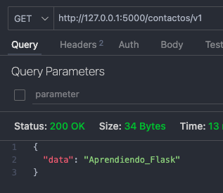

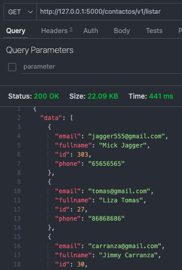

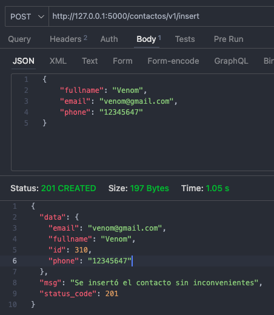

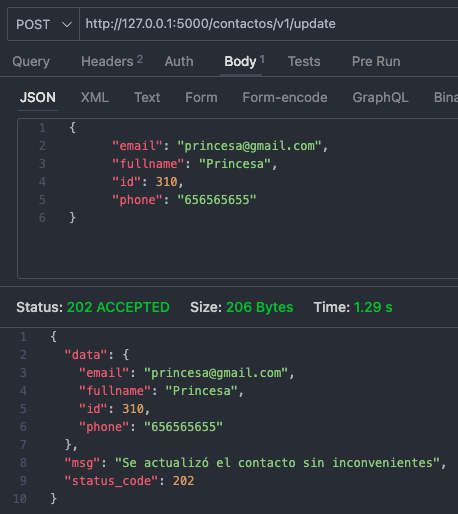

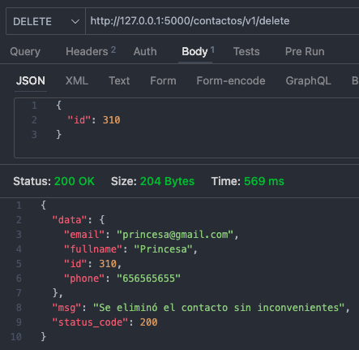


- **Predio:**

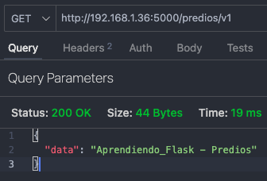

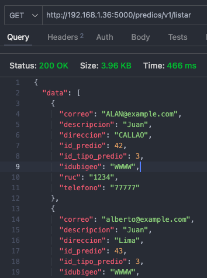

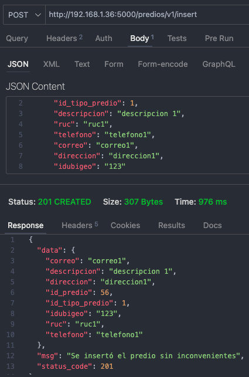

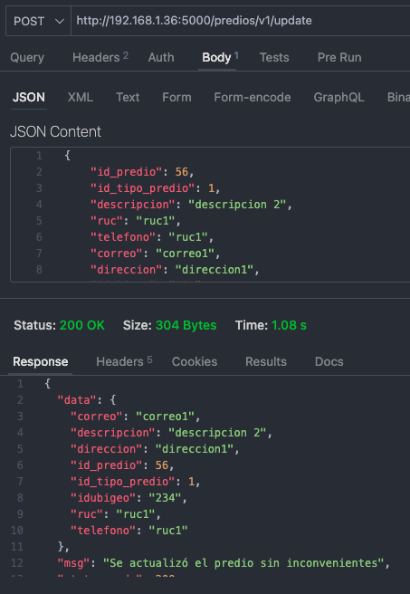

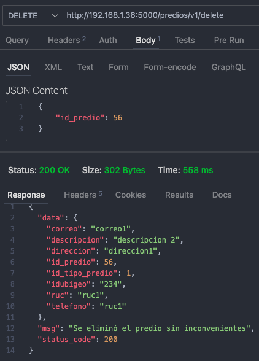


#### Con Render:
- **Contacto:**

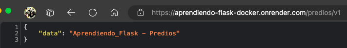

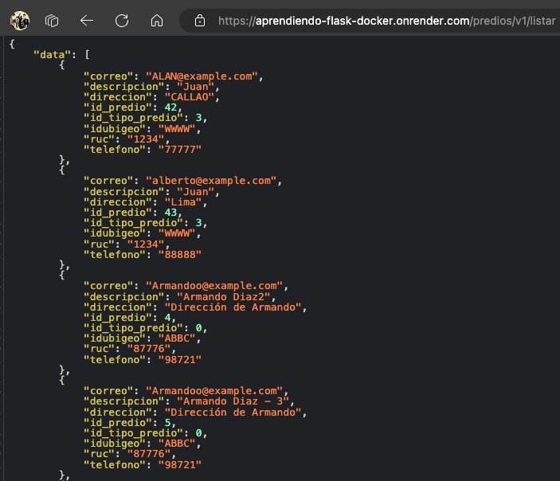


- **Predio:**

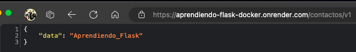

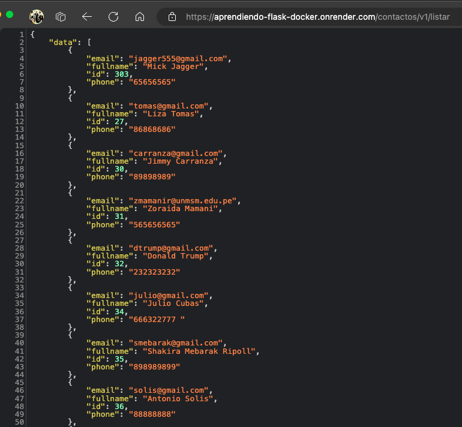